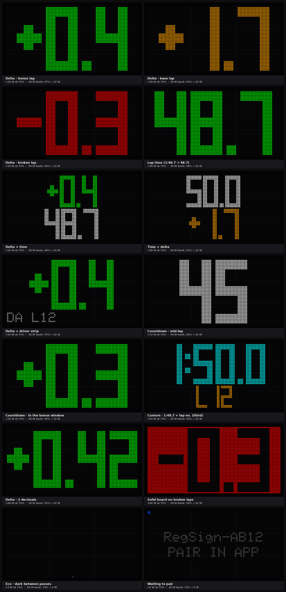

# Regularity LED Sign

A Bluetooth pit-board sign. The Regularity app sends it each lap's delta or lap time, and drivers can read it from about 50 m at speed.

- **Size:** 640 × 320 mm, from a 2 × 2 grid of outdoor P10 RGB panels (64 × 32 pixels). That's enough for three digits (`48.7`, `+0.4`).
- **Digits:** about **300 mm tall**, above the roughly 250 mm needed at 50 m. For 460 mm digits or two lines (delta + time), build the [larger 3 × 3 sign](#larger-3--3-sign).
- **Readability:** about 5,000–7,000 nit outdoor panels behind a matte black louvre, so it reads in direct sun.
- **Display:** choose a preset (delta, lap time, countdown…) or your own fields and colours in the app. Red is off by default, since some formats ban it; broken laps show in orange.
- **Power:** a 30 W USB-C power bank, through a plain USB-C cable. With the digits shown for 15 s after each lap, it should last well over a 6-hour day.

```
 Regularity app ──BLE (≤20-byte writes)──▶ ESP32-S3 (MatrixPortal S3) ──HUB75──▶ 4 × P10 panels
 (phone on pit wall)                         firmware/ in this folder           ▲
                                                                               5 V
                                                    30 W USB-C power bank ─────┘
```



*These are rendered by the firmware's real drawing code (see [Previewing layouts](#previewing-layouts)). Under each screen: estimated draw at 75% brightness, and the brightness on a 30 W bank's power budget. The two-line screens show why two lines need the 3 × 3 sign: on 2 × 2 each line is only about 150 mm tall. [3 × 3 renders](docs/screens-3x3.png).*

## How it works

1. **The sign** is 4 LED panels on a frame, driven by an ESP32 board running the firmware in `firmware/`. It advertises itself over Bluetooth LE as `RegSign-XXXX`.
2. **Pair once** in the app (**Settings → LED Sign → Find sign**). The app remembers the sign and reconnects by itself, including after the sign is power-cycled or a power bank is swapped.
3. **Time as normal.** Each time a lap is recorded for the active driver, the app sends one small Bluetooth message (lap type, delta, lap time, lap number, driver initials). The sign shows it within about a second. Lap edits, deletes, changeovers and driver switches re-send it.
4. **The sign lights up when it matters.** While the stopwatch runs, it shows the digits for a set time after each lap starts (10–30 s, chosen in the app), then goes dark until the next lap. It can also light up a little before the car is due. When the stopwatch is stopped, the sign stays lit.
5. **The stopwatch is mirrored.** The app tells the sign when the lap started and what the target is. The sign runs its own timing (the display window, countdown, lap clock), so nothing is sent every second.
6. **The sign does the drawing.** The app sends data and settings, not pixels. The firmware picks the largest digits that fit, colours them, and dims itself if needed to stay within the power budget.
7. **Settings persist on the sign**, so after a reboot it looks the same before the app reconnects.

Contents: [How it works](#how-it-works) · [Parts list](#parts-list) · [Buying the panels](#buying-the-panels) · [Building it](#building-it) · [Power](#power) · [Firmware](#firmware) · [What the sign shows](#what-the-sign-shows) · [Using different hardware](#using-different-hardware) · [App](#app) · [Protocol](#protocol) · [Troubleshooting](#troubleshooting)

---

## Parts list

Prices are rough AUD estimates from late 2026 (AliExpress, Core Electronics, Jaycar and similar). Check current prices before ordering.

| # | Part | Qty | Spec / notes | Approx. A$ |
|---|------|-----|--------------|-----------|
| 1 | **Outdoor P10 RGB LED module** | 4 (+1 spare) | 320 × 160 mm, 32 × 16 px, **1/4 scan**, HUB75, 5 V, SMD, front IP65, ≥ 5,000 nit. Most come with a ribbon cable and a power lead. | 25–45 each |
| 2 | **Adafruit MatrixPortal S3** (product 5778), *or an ESP32 / ESP32-S3 DevKit you already have* | 1 | Bluetooth controller. The MatrixPortal plugs straight into the first panel's HUB75 input; a DevKit needs jumper wires (see [Controller boards](#controller-boards)). | 40–55 |
| 3 | **30 W USB-C PD power bank**, e.g. your Cygnett 20,000 mAh | 1 | Must give **5 V at 3 A** on USB-C (almost all do). | — |
| 4 | **USB-C "sink" cable or breakout → bare wires** | 1 | Has 5.1 kΩ CC resistors so the bank turns on 5 V at up to 3 A (search "USB-C to DC bare wire 5V 3A" or "USB-C 5V sink breakout"). A USB-C PD trigger board set to 5 V also works. Use 1 mm² wire, ≤ 2 m. | 10–15 |
| 5 | 5 V distribution | 1 set | Wago 221 blocks, a 5 A inline fuse, and **0.75–1.5 mm²** leads to each panel. | 15 |
| 6 | USB-C pigtail (screw terminal → USB-C) | 1 | Powers the MatrixPortal from the 5 V bus. A DevKit can take 5 V on its 5V/VIN pin instead. | 10 |
| 7 | HUB75 ribbon cables | 3 | Usually included with the panels. | incl. |
| 8 | Frame | 1 | A 680 × 360 mm backing board (6 mm ply or 3 mm aluminium composite), 20 × 20 mm aluminium angle round the edge, and two steel strips for the panel magnets. See [Frame](#frame). | 30–60 |
| 9 | Front louvre / hood | 1 | Matte black. Use a louvre grille, or a 50 mm hood over the top edge plus matte black paint on the frame. Optional smoked polycarbonate face (2–3 mm). | 20–50 |
| 10 | Mounting | 1 | A pit-wall clamp or tripod bracket. The finished sign weighs about 3 kg. | 30–60 |
| | **Total** (plus your bank) | | | **≈ 280–490**, or ≈ 240–435 with your own ESP32 |

**Budget build, about A$155–255:**
- 4 panels at the cheap end, no spare.
- Your own ESP32 DevKit.
- The USB-C cable and wiring (rows 4–6).
- A frame and hood made from timber or aluminium offcuts and Correx, painted matte black.
- A clamp or tripod you already have.

**Optional, for full brightness all the time:** a USB-C PD trigger set to **9 V** plus a **9 V → 5 V, 8–10 A step-down converter** (about A$25–45). This gets the bank's full 30 W instead of 15 W. You won't need it with the after-lap display window; see [Power](#power).

**Tools:** PlatformIO (VS Code) to flash the firmware, a multimeter, and ideally a USB-C power meter, so you can see what the sign really draws.

## Buying the panels

Panel listings are vague, so check these points. **Buy one panel first, flash the firmware and confirm it works**, then order the rest.

There's **no brand to look for.** P10 modules are generic parts made by many factories (Qiangli, Hoozoe, EagerLED, Lightall, JYC and others) and sold under the seller's name. The chips can change between batches from the same seller. What matters is the spec below. Ask the seller to confirm the **scan rate** and the **driver chip** before buying.

1. **Scan rate.** Outdoor P10 RGB panels are usually **1/4 scan**. That's the default here (`PANEL_P10_OUTDOOR_32x16_4S`).
   - Some 1/4-scan modules are wired differently inside. If yours shows scrambled blocks, use `PANEL_P10_OUTDOOR_32x16_4S_ALT`.
   - 1/8-scan and 1/16-scan panels also work with a one-line change; see [Using different hardware](#using-different-hardware).
   - Avoid 1/2-scan and static (1/1) panels, which this firmware doesn't support.
2. **Interface.** It must be **HUB75 or HUB75E** (a 16-pin IDC socket). Panels marked HUB12, HUB08 or "single colour" won't work.
3. **Driver chip.** Read the markings on the chips on the back. Plain shift registers (ICN2037, MBI5024, SM16208…) work as they are. **FM6126A** and **ICN2038S** panels need `PANEL_DRIVER` changed in `config.h`, otherwise they stay black.
4. **Full colour (RGB)**, not single or dual colour.
5. **Outdoor / high brightness**, ideally ≥ 5,000 cd/m², with a waterproof front.

## Building it

### Layout and data chain

Seen from the **front**, with the default `GRID_CHAIN CHAIN_TOP_RIGHT_DOWN` (serpentine):

```
 data in ─▶ ┌──2──┬──1──┐ ◀─ controller plugs into panel 1's input
            └─────┴──┬──┘
            ┌──3──┬──4──┐   row 2 runs the other way: these two panels are
            └─────┴─────┘   mounted upside down (rotated 180°)
```

- Each panel's HUB75 **output** connects by ribbon to the next panel's **input**. The arrows printed on the back of each panel show the data direction.
- To keep **all panels upright**, use `CHAIN_TOP_RIGHT_DOWN_ZZ` and a longer ribbon from panel 2 back to panel 3.
- If the test pattern comes out scrambled or mirrored, change `GRID_CHAIN`. The HUB75 library's [VirtualMatrixPanel docs](https://github.com/mrcodetastic/ESP32-HUB75-MatrixPanel-DMA/tree/master/examples/VirtualMatrixPanel) have diagrams of every option.

### Frame

```
   front                                   back
 ┌──────────────── hood ────────────────┐ ┌──────────────────────────────────────┐
 │ ┌───────────────┬───────────────┐    │ │  ══════ steel strip ═══════════════  │
 │ │      P10      │      P10      │    │ │ [MatrixPortal]   [Wago 5 V]  handle  │
 │ ├───────────────┼───────────────┤    │ │  ══════ steel strip ═══════════════  │
 │ │      P10      │      P10      │    │ │          bank in a pouch / velcro    │
 │ └───────────────┴───────────────┘    │ └──────────────────────────────────────┘
 └──── 20 mm black border, 680 × 360 ───┘
```

- **Backing board:** 6 mm marine ply or 3 mm aluminium composite panel (ACM, e.g. Alupanel), cut to 680 × 360 mm and painted **matte black**. That gives a 20 mm border round the 640 × 320 mm of panels.
- **Mounting the panels:** P10 modules usually come with magnet posts on the back.
  - Glue or rivet two strips of galvanised steel flat bar (25 × 3 mm) across the board, so the panels snap on and off.
  - Or unscrew the magnets and fix the panels with M3 screws through the board; check the thread on your panels.
  - Butt the panels tightly together so there are no gaps between digits.
- **Edge:** 20 × 20 mm aluminium angle around the perimeter, riveted or screwed on. It stiffens the board and protects the panel edges.
- **Sun hood:** a 50–80 mm deep strip of matte black Correx or aluminium flashing along the top edge, plus the sides if you like. Shading the panels is what keeps the black background black in sunlight, which does more for contrast than brightness.
- **Back:**
  - The MatrixPortal and Wago blocks go in a small box or under a cover. The panel fronts are weatherproof (IP65); the backs and electronics are not.
  - Add a strain relief for the USB-C cable.
  - Velcro or a pouch holds the power bank.
- **Holding it up:** the finished sign is about 3–3.5 kg.
  - Bolt a handle to the back to hold it out like a pit board.
  - Or fit a pit-wall clamp, or a 1/4"-20 tripod plate in the centre of the back.

### Power wiring

```
 30 W USB-C bank ── USB-C sink cable (5 V, up to 3 A, 1 mm²) ─[5 A fuse]─▶ +5 V / GND (Wago) ─┬─ 4 × panel power leads
                                                                                            └─ USB-C pigtail ─▶ MatrixPortal S3
```

- **Give every panel its own power lead from the Wago blocks.** Never daisy-chain power through panels.
- **All grounds must be common**: the panels, the supply and the controller.
- Keep the bank at the bottom of the frame or in a pouch on it, so the USB-C cable stays short.

## Power

The sign only lights the pixels in the digits, and only while it's showing them. The firmware estimates each frame's draw and **dims itself to stay under the budget** set in the app (**Settings → LED Sign → Power source**). The budget includes about 1.8 W for the panels' and controller's idle draw.

Estimated draw on the 2 × 2 sign, from the preview tool, at 75% brightness:

| What's showing | Draw | On USB 5 V (13 W budget) | On 30 W PD (22 W budget) |
|---|---|---|---|
| Delta `+0.4` (green / orange / yellow) | ≈ 13–14 W | ≈ 70–75% | full 75% |
| Lap time `48.7` | ≈ 15 W | ≈ 65% | full 75% |
| Countdown in white (mid-lap) | ≈ 28 W | ≈ 35% | ≈ 57% |
| Solid board on broken laps | ≈ 31 W | ≈ 30% | ≈ 51% |
| Dark between laps | ≈ 1.8 W | — | — |

These estimates come from typical panel figures. **Measure your own sign** with a USB-C power meter, and adjust `WATTS_PER_LED_CHANNEL` and `IDLE_WATTS_PER_PANEL` in `config.h` until the serial log's `est. … W` line matches. Even 65% brightness on a 5,000+ nit outdoor panel is over 3,000 nit, brighter than a phone screen in sunlight.

### Running from your power bank

**Your Cygnett 30 W 20,000 mAh is enough:**

1. **Plug in by USB-C at 5 V** (parts list row 4). In the app, set **Power source → USB 5 V**. That's a 13 W budget, which keeps you inside the bank's 15 W at 5 V.
2. **Set Show the digits → 15 s after each lap** (**Settings → LED Sign**). While the stopwatch runs, the sign shows each lap's digits for 15 s from lap start, then goes dark until the next lap. You can choose 10, 15, 20 or 30 s, or Always.

**Runtime:** the bank holds about 74 Wh, and about 63 Wh reaches the sign at 5 V.

| Setup | Average draw | Runtime |
|---|---|---|
| USB 5 V, **15 s after each lap**, 1:45 laps | ≈ 3.5 W | **≈ 15+ h** ✅ |
| USB 5 V, 20 s after each lap, 1:00 laps | ≈ 5.5 W | ≈ 11 h ✅ |
| USB 5 V, 15 s after + 15 s before the car is due, 1:00 laps | ≈ 8 W | ≈ 8 h ✅ |
| USB 5 V, **always lit** | ≈ 13 W | ≈ 4.5 h ❌ |

The biggest unknown is the panels' real idle draw. If it measured 1 W per panel instead of 0.3 W, the 15 s window would still run about 10 h, comfortably over 6. The bank must also not switch itself off while the sign is dark; at about 360 mA idle, it shouldn't.

<a id="larger-3--3-sign"></a>
### Larger 3 × 3 sign

For 460 mm digits, or two readable lines (delta over lap time), build a 3 × 3 grid (960 × 480 mm, 9 panels, about 7 kg):
- Set `GRID_COLS 3` and `GRID_ROWS 3` in `config.h`.
- Digits draw about 33–39 W at 75% ([renders](docs/screens-3x3.png)).
- On the bank, use the 9 V trigger + converter (**Power source → 30 W PD**). With a 15 s window it runs about 10 h, and the digits dim to about 45% while lit.
- For full brightness, use a **12 V 20–30 Ah LiFePO4** with a 12 V → 5 V 30–40 A converter, fused, with a 15 A fuse per row of panels (**Power source → Battery**). Feed every panel separately with 1.5 mm² wire from a bus bar.

---

## Firmware

**This is ESP32 firmware.** "Arduino" here only means the *Arduino-ESP32 framework*, Espressif's library layer on top of ESP-IDF. No Arduino board or Arduino IDE is involved. You build and flash it with PlatformIO, the same way as any ESP32 project. The libraries this firmware uses (HUB75 DMA, NimBLE) also support plain ESP-IDF if you'd rather port it to `idf.py`.

The firmware is in `firmware/`, a PlatformIO project. It has been compile-tested against Arduino-ESP32 2.0.17, ESP32-HUB75-MatrixPanel-DMA 3.0.14, NimBLE-Arduino 2.3.0 and Adafruit GFX 1.12.1, for the MatrixPortal S3, a generic ESP32-S3 and a classic ESP32. **It hasn't been tested on real panels yet.** Expect to adjust `config.h` on first power-up.

1. Install [VS Code](https://code.visualstudio.com/) and the **PlatformIO** extension.
2. Open the `hardware/led-sign/firmware` folder.
3. Edit `src/config.h` if your hardware differs from the defaults.
4. Plug the board in by USB and upload with the env for your board:
   - `pio run -e matrixportal_s3 -t upload` for the Adafruit MatrixPortal S3
   - `pio run -e esp32s3_generic -t upload` for any ESP32-S3 DevKit
   - `pio run -e esp32_generic -t upload` for a classic ESP32 DevKit / WROOM-32
5. Power the sign. It shows its name and `PAIR` (`RegSign-XXXX` and `PAIR IN APP` on the 3 × 3), and a blue dot blinks in the corner until a phone connects.
6. In the app, go to **Settings → LED Sign → Find sign**, pair, then tap **Test sign**. You should see 5 solid colour fills, then `88.8` in a white frame crossed by a blue diagonal. If the image is scrambled, see [Troubleshooting](#troubleshooting).

### Testing with one panel

**Shopping list for the bench test (about A$80–140):**

| Item | Model / part no. | Where | Approx. A$ |
|---|---|---|---|
| Controller | **Adafruit MatrixPortal S3**, Adafruit PID **5778** | Core Electronics SKU **ADA5778** (about A$39), Little Bird. Generic Amazon resellers ask about A$57. | 39–57 |
| Panel | Generic **"P10 outdoor full colour SMD3535 LED module, 320 × 160 mm, 32 × 16, 1/4 scan, HUB75"** (no standard model number; see [Buying the panels](#buying-the-panels)) | AliExpress / eBay / Amazon. Buy from the seller you'd get the other three from, so all four match. | 25–45 + postage |
| USB-C cable | Any USB-C data cable (C-to-C, or A-to-C for your computer) | — | 0–15 |
| *Optional:* power meter | **FNIRSI FNAC-28** (cheap) or **FNIRSI FNB58** (logs current) | Core Electronics SKUs **CE10557** (about A$28) / **CE10556** (about A$75) | 28–75 |
| *Only if needed:* header adapter | 2 × 8 pin, 2.54 mm **male–male** IDC header adapter | AliExpress, Core Electronics | 2–5 |

The header adapter is for panels whose HUB75 socket sits in a deep plastic shroud, so the MatrixPortal can't push straight onto it. The panel's own ribbon has sockets on both ends, as does the MatrixPortal, so this adapter joins them.

- **Power:** for one panel you don't need the 5 V wiring kit. The MatrixPortal can feed one panel from its 5 V screw terminals using the panel's power lead (check Adafruit's MatrixPortal S3 guide). Power the MatrixPortal from the Cygnett by USB-C.
- **USB-C power meter:** worth having. It shows what the sign really draws, so you can check the power estimates before buying the rest.

Before buying all four panels, you can test the whole system (Bluetooth, the app, every layout, colours, the display window, power limiting) on one panel and the MatrixPortal on your bench:

1. Flash the one-panel build: `pio run -e matrixportal_s3_single -t upload`.
2. Plug the MatrixPortal into the panel's input and power both from the 5 V USB-C cable. One panel draws only about 2–8 W.
3. Pair and test from the app as normal.

It's the same firmware, at 32 × 16 px, so the digits are about 140 mm tall ([renders](docs/screens-1x1.png)). When the other panels arrive, flash `matrixportal_s3` (2 × 2) again. Nothing in the app changes.

The sign saves its settings (colours, layout, power) in flash, so it boots looking the same. The app also re-sends everything each time it connects.

### Previewing layouts

`firmware/preview/build.sh` compiles the firmware's real `renderer.cpp` and `power.cpp` for your computer. It writes PNGs of each example screen, plus the contact sheet at the top of this page, to `firmware/preview/out/`. `COLS=3 ROWS=3 ./build.sh` renders the 3 × 3 sign instead. To preview your own layout, add a `Scene` to `preview.cpp`. It needs `g++`, `git` and Python with Pillow.

## What the sign shows

Choose in **Settings → LED Sign → Display**. The app's preview matches the sign.

| Preset | Main line | Second line |
|---|---|---|
| **Delta** | `+0.4` full height | — |
| **Lap time** | `48.7` full height (1:48.7, minutes implied) | — |
| **Delta + time** | `+0.4` | `48.7` (half height; needs the 3 × 3 sign at 50 m) |
| **Time + delta** | `48.7` | `+0.4` (half height; needs the 3 × 3 sign at 50 m) |
| **Delta + driver** | `+0.4` | `DA L12` strip |
| **Countdown** | Live countdown to the target, with the delta for 8 s after each lap | — |
| **Custom** | Any field, any colour | Any field, at small strip, third or half height |

**Fields:**

| Field | Example | Notes |
|---|---|---|
| Delta | `+0.4` | |
| Lap time | `48.7` | 1:48.7 with the minute implied; the seconds always have 2 digits, so 1:01.3 shows `01.3` |
| Lap time (full) | `1:48.7` | |
| Countdown | `45` → `9.4` → `+0.3` | Live |
| Lap clock | `40.0` | Live, minutes implied |
| Lap no. | `L12` | |
| Driver | `DA` | |
| Driver + lap | `DA L12` | |
| Target | `48.3` | |

**Colours:** each line is either **Lap type** or a **fixed colour**.
- *Lap type* uses the colour of the last lap. Each colour is set in the app; the defaults are bonus green, base yellow, broken orange, changeover blue, safety white.
- **Red is off by default.** Some regularity formats ban red on pit boards. While **Allow red** is off, the red swatch is hidden and any red already set is replaced with orange. Broken laps also always show a minus sign, so they don't rely on colour.
- For live fields, *Lap type* means the colour the lap would get if it ended now: white before the target, bonus colour in the 1-second bonus window, then base colour.

**For live fields** (countdown, lap clock), *After each lap, show* swaps in the delta or lap time for 5, 8 or 15 s after each lap.

**Formatting:**
- Deltas always show a sign.
- Deltas and times are **truncated, not rounded**, so a 0.96 s bonus lap shows `+0.9`, never a misleading `+1.0`.
- One or two decimals (set in the app).
- Digits are a bold 7-segment style sized to fill the space. On the 2 × 2 sign they're about 300 mm full height, or about 150 mm on a half line. On the 3 × 3 they're about 460 mm, or about 220 mm on a half line. Letters (driver initials) use a scaled pixel font.

**When the digits show** (**Show the digits**):
- **10–30 s after each lap:** lit for that long from lap start, then dark until the next lap. This is the big power saver.
- **Always:** lit the whole time.
- **Also light up before the car is due** (Off / 10 / 15 / 20 s): useful with the countdown, which otherwise only shows while the sign is lit.
- The window only applies while the stopwatch runs. When it's stopped, the sign stays lit.

**Extras:**
- Flash safety car laps.
- Solid board on broken laps (heavy on power).
- Flip 180°.

## Using different hardware

Every hardware choice is in `firmware/src/config.h`. The renderer sizes the digits to whatever resolution you end up with, and the app works with any sign that speaks the [protocol](#protocol).

### Controller boards

If you already use ESP32 dev boards, you don't need the MatrixPortal. Wire the board to the first panel's HUB75 input with jumper wires (or a cheap HUB75 breakout), share ground with the 5 V supply, and use the matching env.

| HUB75 pin | Classic ESP32 DevKit (`esp32_generic`) | ESP32-S3 DevKitC (`esp32s3_generic`) |
|---|---|---|
| R1 / G1 / B1 | 25 / 26 / 27 | 4 / 5 / 6 |
| R2 / G2 / B2 | 14 / 12 / 13 | 7 / 15 / 16 |
| A / B / C / D | 23 / 19 / 5 / 17 | 18 / 8 / 3 / 42 |
| E (64-px-high panels only) | — | — |
| LAT / OE / CLK | 4 / 15 / 16 | 40 / 2 / 41 |
| GND | GND (connect all three HUB75 GND pins) | GND |

Outdoor P10 1/4-scan panels only use A and B, so C, D and E can stay unconnected. For different pins, set `SIGN_BOARD BOARD_CUSTOM` and list them in `config.h`.

| Board | Works? | How |
|---|---|---|
| Adafruit MatrixPortal S3 | ✅ Recommended | Default (`BOARD_MATRIXPORTAL_S3`) |
| Any ESP32-S3 dev board + HUB75 wiring/shield | ✅ | `env:esp32s3_generic` (library default S3 pins), or `BOARD_CUSTOM` with your pins |
| Classic ESP32 (ESP32 Trinity, DevKit + HUB75 shield, Huidu-style ESP32 "HUB75 controller" boards) | ✅ | `env:esp32_generic` (library default pins: R1 25, G1 26, B1 27, R2 14, G2 12, B2 13, A 23, B 19, C 5, D 17, LAT 4, OE 15, CLK 16), or `BOARD_CUSTOM` |
| Adafruit MatrixPortal M4, ESP32-S2 boards | ❌ | No Bluetooth |
| ESP32-C3 / C6 / H2 | ❌ | Not supported by the HUB75 library |
| Raspberry Pi, Arduino Uno/Mega, Teensy | ❌ | Not supported by this firmware |

### Panels

| Panel | `SIGN_PANEL` | Notes |
|---|---|---|
| Outdoor P10 RGB 32×16, 1/4 scan | `PANEL_P10_OUTDOOR_32x16_4S` | Default |
| Outdoor P10 RGB 32×16, 1/4 scan, other wiring | `PANEL_P10_OUTDOOR_32x16_4S_ALT` | Try this if the default comes out scrambled |
| P10 RGB 32×16, 1/8 scan | `PANEL_P10_32x16_8S` | Common "semi-outdoor" P10 |
| 64×32, 1/16 scan (P3–P6 indoor) | `PANEL_64x32_16S` | Standard panels. Fine indoors, too dim in direct sun. |
| Outdoor 64×32, 1/8 scan (P5/P6/P8) | `PANEL_OUTDOOR_64x32_8S` | 2 × 3 of P5 64×32 is about 640 × 480 mm |
| 64×64, 1/32 scan | `PANEL_64x64_32S` | Needs the E pin (the MatrixPortal has it) |
| Anything else | `PANEL_CUSTOM` | Set `PANEL_RES_X/Y`, `PANEL_MAPPING` (a library `ScanTypeMapping<...>` or your own struct in `panel_mappings.h`) and `PANEL_FOUR_SCAN` |

- **Grid size:** change `GRID_COLS` and `GRID_ROWS` (default 2 × 2; 3 × 3 for the larger sign).
- **Odd panels:** some outdoor panels use unusual internal wiring that no preset covers. The library's *Pixel_Mapping_Test* example helps you work out a custom mapping.
- **WS2812 / NeoPixel LED matrices** aren't HUB75. They'd need a different display driver in `main.cpp` (e.g. Adafruit_NeoMatrix), but `renderer.cpp` draws to any Adafruit_GFX surface, so nothing else changes.

### Ready-made / commercial LED signs

Signs with their own controller (Huidu, Novastar, Linsn, "LED badge"/"CoolLED"-style Bluetooth signs) use closed protocols and **won't work directly**. Often you can still use their panels: remove the controller and plug a MatrixPortal S3 into the first panel's HUB75 input.

---

## App

The app side is in `apps/mobile`:

| File | Role |
|---|---|
| `services/LedSignService.ts` | BLE scanning and pairing, auto-reconnect with backoff, a write queue, and re-sending the current state on every connect |
| `components/LedSignBridge.tsx` | Watches the active driver's latest lap (new laps, edits, deletes, changeover/safety toggles, driver switches) and sends it to the sign |
| `components/LedSignSettings.tsx` | **Settings → LED Sign**: a How it works explainer, pair/forget, test, display presets and a custom layout editor with live preview, decimals, brightness, power source and Eco, lap-type colours, solid-board, flash and flip toggles |
| `context/AppContext.tsx` → `reportTimerState` | Relays the stopwatch so live fields (countdown, lap clock) and Eco run on the sign itself |
| `packages/core/src/ledSign.ts` | The protocol encoder (unit-tested), shared with the docs below |

Bluetooth uses `react-native-ble-plx`. Its Expo config plugin in `app.json` adds the iOS Bluetooth permission text, the `bluetooth-central` background mode, and the Android `BLUETOOTH_SCAN`/`BLUETOOTH_CONNECT` permissions.

- **It's a native module, so it needs a new EAS build** (`pnpm build:ios` / `pnpm build:android`). An `eas update` alone can't add it.
- **Give the new binaries a new `runtimeVersion`**, so OTA updates for them stay separate from older builds.
- **Older binaries are safe:** if they receive this JavaScript anyway, the LED Sign section just shows "Not available in this build".
- **iOS App Review:** mention the background mode in the review notes, e.g. "Bluetooth is used to send lap times to the team's LED pit-board sign while the timer runs."

The phone talks to the sign at short range (about 10–30 m line of sight), so keep the timing phone on the pit wall near the sign. The 50 m figure is the **driver's** reading distance.

## Protocol

GATT service `a9fa0001-8e2e-4c12-9682-7dd27dea5a5b`:

| Characteristic | UUID | Properties |
|---|---|---|
| Command | `a9fa0002-8e2e-4c12-9682-7dd27dea5a5b` | write / write-without-response. One packet per write, ≤ 20 bytes. |
| Info | `a9fa0003-8e2e-4c12-9682-7dd27dea5a5b` | read: `proto=1;fw=1.1.0;w=64;h=32` |

Byte 0 is the opcode. Integers are little-endian.
- **Lap type codes:** 0 bonus, 1 base, 2 broken, 3 changeover, 4 safety.
- **Field codes:** 0 none, 1 delta, 2 lap time, 3 lap time full, 4 countdown, 5 lap clock, 6 lap no., 7 driver, 8 driver + lap, 9 target.
- **Colour mode:** 0 = by lap type, 1 = fixed RGB.

| Op | Name | Layout | Bytes |
|---|---|---|---|
| `0x01` | Lap | op, lapType u8, lapNumber u16, deltaMs i32, targetMs u32, initials 3 × ASCII, timeMs u32 | 19 |
| `0x02` | Timer | op, running u8, elapsedMs u32 (at send time), targetMs u32 | 10 |
| `0x03` | Config | op, brightness u8 (1–255), reserved u8, decimals u8 (1/2), flags u8 (bit0 fill on broken, bit1 flip 180°, bit2 flash safety), RGB × 5 in lap-type order | 20 |
| `0x04` | Clear | op (blank the delta) | 1 |
| `0x05` | Test | op (5 s test pattern) | 1 |
| `0x06` | Layout | op, main field u8, main colour mode u8, main RGB, second field u8, second colour mode u8, second RGB, second size u8 (0 strip, 1 third, 2 half), hold field u8, hold seconds u8 | 14 |
| `0x07` | Power | op, budget W u16 (0 = no limit), light-before-due seconds u8 (0 = off), show-after-lap seconds u8 (0 = always lit) | 5 |

The timer sends **elapsed** time rather than a timestamp, so the sign needs no clock sync; it counts on from when the packet arrives. If you change the protocol, change `packages/core/src/ledSign.ts`, its tests, and `firmware/src/protocol.h` together.

## Troubleshooting

| Symptom | Fix |
|---|---|
| Panels stay black, but the serial log says ready | Set `PANEL_DRIVER` to match the chips (FM6126A / ICN2038S). Check the 5 V supply and that the ribbon is in the panel's **input**. |
| Image looks like scrambled stripes or blocks inside each panel (the test's white frame and blue diagonal come out broken) | Wrong `SIGN_PANEL` / scan type. On outdoor P10s, try `PANEL_P10_OUTDOOR_32x16_4S_ALT` first, then the 1/8 preset. The HUB75 library's *Pixel_Mapping_Test* example helps work out an unusual panel. |
| Each panel looks right, but they're in the wrong order or upside down | Wrong `GRID_CHAIN`. Try the other `CHAIN_*` options, or `_ZZ` if every panel is upright. |
| Pixels smeared or shifted by one column | Set `PANEL_CLK_PHASE false`. |
| Ghosting or flicker on generic ESP32 boards | Some panels need 5 V logic. Use a HUB75 shield with a 74HCT245 level shifter, or the MatrixPortal S3. |
| Sign resets or flickers on bright frames | The supply is browning out. Lower `MAX_BRIGHTNESS`, use a bigger converter or thicker wire, and check every panel has its own feed. |
| Power bank cuts out on bright frames | The bank is being asked for more than it gives. Pick a lower **Power source**, or calibrate `WATTS_PER_LED_CHANNEL` upwards. If you use a 9 V trigger, check it really negotiated 9 V. |
| Power bank switches off while the sign is dark | The bank's low-current auto-off kicked in. Check with **Show the digits → Always**; if that stays on, enable the bank's low-current/trickle mode if it has one (often a double-press of the button). |
| Classic ESP32 boot-loops only while the panel is connected | GPIO 12 (G2) is a boot strapping pin. Move G2 to another free pin (e.g. 32) with `BOARD_CUSTOM`. |
| App can't find the sign | Bluetooth on? Location/Bluetooth permission granted (Android)? Is the sign showing `PAIR IN APP`? Only one phone can be mid-pairing at a time. |
| Delta doesn't update | Check **Settings → LED Sign** shows *Connected*. The sign shows the **active driver's** latest lap, so check the right driver is selected on the Timer. |
